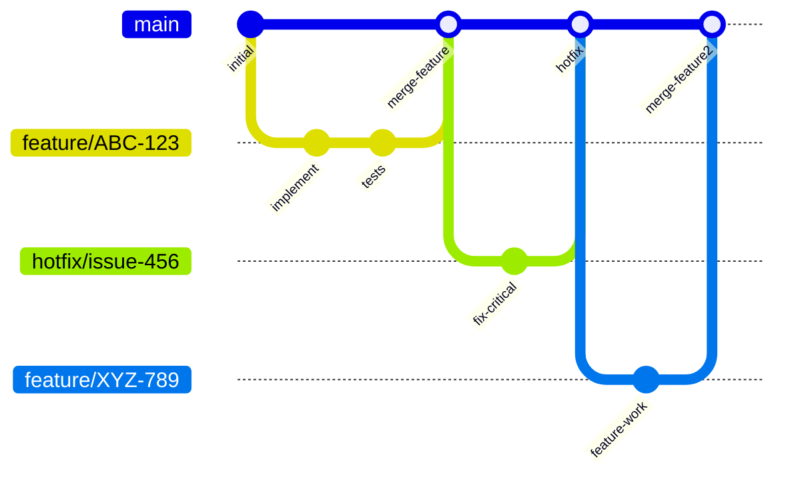

# Development Process

This document describes the **current** development process used by the team for this repository. It is the canonical, maintained artifact for both our development workflow and configuration‑management practices. All team members are expected to follow this process; any material change to the workflow must be reflected here.

---

## 1. Agile Planning & Backlog Management

We use **GitHub Projects** as our primary planning and tracking tool. The project board is configured with the following views:

- **Product Backlog** – a view of all open issues, prioritised by the Product Owner.
- **Sprint Backlog** – a filtered view showing issues selected for the current sprint.
- **Team Dashboard** – a personal view for each developer to see their assigned tasks.

The board contains these columns (statuses):

| Column          | Purpose                                                                                                 | Entry Criteria                                                                                  |
|-----------------|---------------------------------------------------------------------------------------------------------|-------------------------------------------------------------------------------------------------|
| **Backlog**     | All ideas, bugs, and feature requests not yet scheduled.                                                | Issue is created and triaged; has a clear description and acceptance criteria.                  |
| **Ready**       | Issues that are fully refined and estimated, ready to be pulled into a sprint.                          | Issue has been estimated, acceptance criteria are defined, and all dependencies are resolved.   |
| **In Progress** | Work actively being developed.                                                                          | Developer has created a feature branch and started coding.                                      |
| **Review**      | Code is ready for peer review (Pull Request is open).                                                   | PR is created, CI checks pass, and the PR template is filled.                                   |
| **Done**        | Work is complete, merged, and verified in the target environment (staging/production as appropriate).   | PR is merged, issue is closed, and deployment to the relevant environment is successful.        |

**Sprint cadence:** 2‑week sprints, starting every other Monday. Sprint planning happens on the first day of the sprint; sprint review and retrospective on the last day.

---

## 2. Git & Review Workflow

We use a **modified GitHub Flow** with a long‑lived `main` branch. All development work is done on short‑lived feature branches that are branched from and merged back into `main`. For hotfixes, we also branch directly from `main`.

### 2.1 Branching Strategy

The following diagram illustrates our branching and merging workflow:

